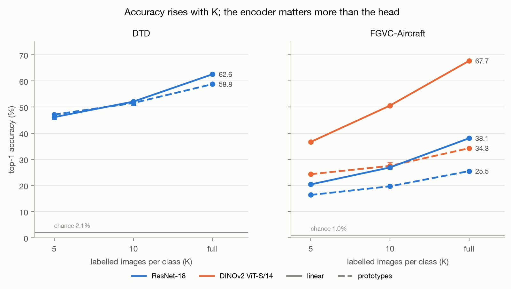
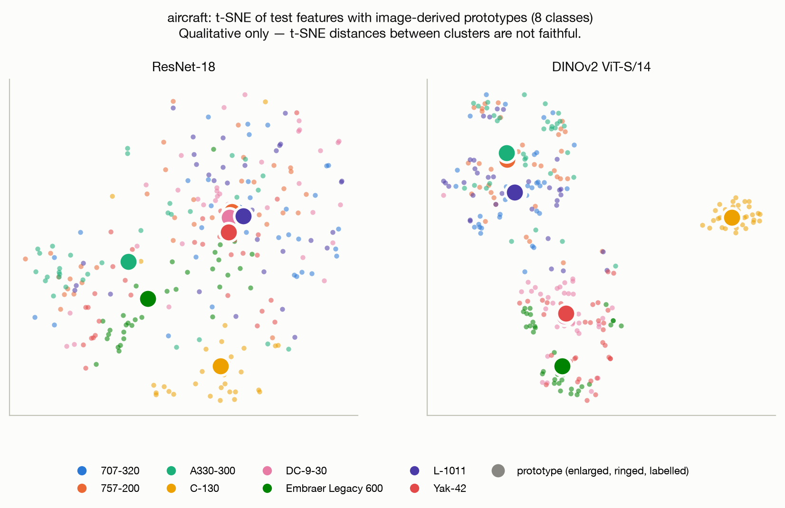
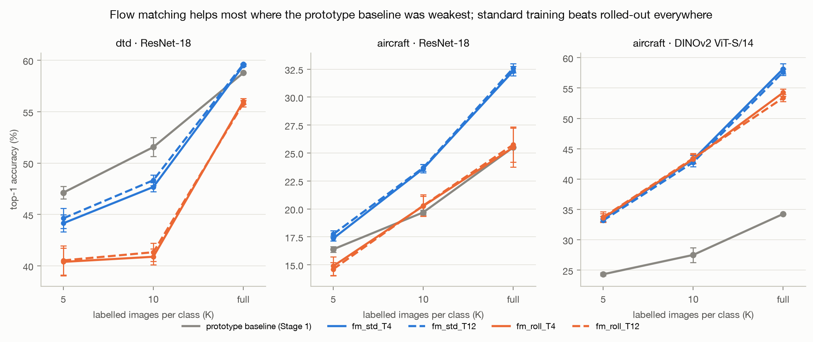
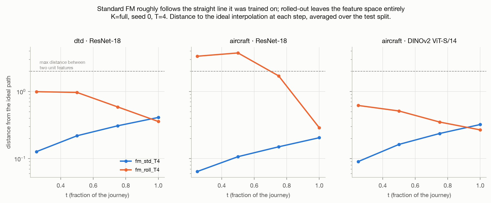
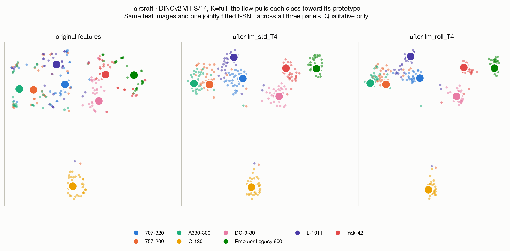
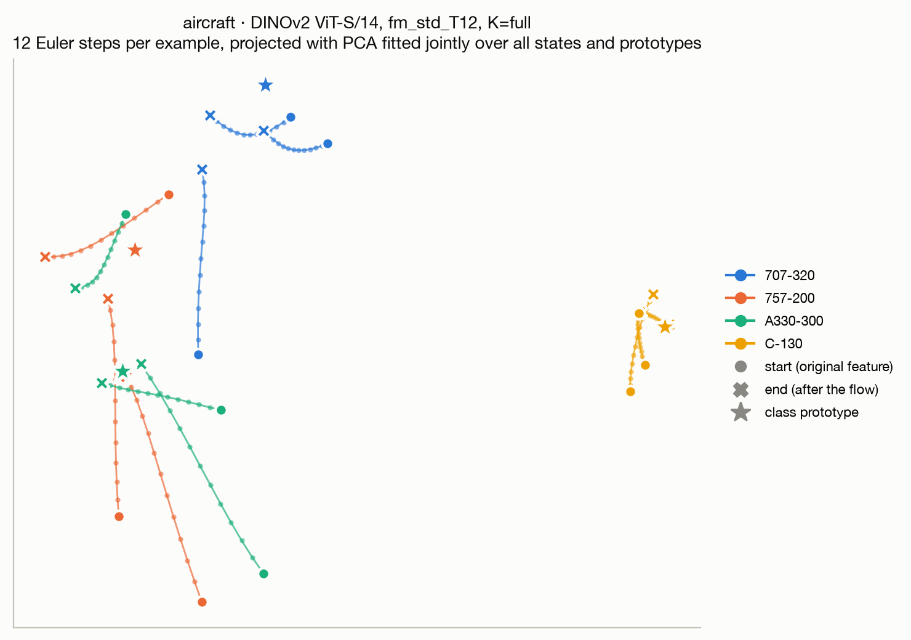

# Flow Matching on Frozen Features

**CVLAB Summer Project · Stages 1–3**

Can a learned transformation of frozen encoder features improve classification? Three stages,
two datasets, 204 experimental runs — and one principle that predicts the outcome of all three.

| | Stage 1 · baselines | Stage 2 · flow to prototypes | Stage 3 · flow before the probe |
|---|---|---|---|
| **Headline** | **67.7%** | **+23.9** | **±0.2** |
| | Best linear probe (Aircraft · DINOv2). ResNet-18 reaches only 38.1% on the same data. | Points gained over the prototype baseline — 72% of the gap between class averaging and a trained classifier. | No meaningful change. The baseline is already the trained optimum. |

| | |
|---|---|
| **Datasets** | DTD (47 texture classes, partition 1) and FGVC-Aircraft (100 variants) |
| **Encoders** | ResNet-18 (512-d) and DINOv2 ViT-S/14 (384-d), both frozen throughout |
| **Protocol** | Official splits, K ∈ {5, 10, all}, three seeds, top-1 on the full test split |
| **Scale** | 204 runs · 183 trained checkpoints · 45 MB of cached features |

Full detail is in [Stage 1](REPORT_STAGE1.md), [Stage 2](REPORT_STAGE2.md) and
[Stage 3](REPORT_STAGE3.md).

---

## Stage 1 — Two classifiers on frozen features

Every image is converted once by a frozen pretrained encoder into a list of numbers, cached to
disk, and never read again. Two rules are then built on those numbers: a **prototype** rule that
averages each class's examples and picks the nearest average, and a **linear probe** trained to
separate the classes.

| Pipeline | Head | K=5 | K=10 | K=all |
|---|---|---:|---:|---:|
| DTD · ResNet-18 | prototypes | 47.13 | 51.56 | 58.78 |
| | **linear probe** | 46.15 | 52.09 | **62.55** |
| Aircraft · ResNet-18 | prototypes | 16.39 | 19.69 | 25.50 |
| | **linear probe** | 20.41 | 26.90 | **38.07** |
| Aircraft · DINOv2 | prototypes | 24.33 | 27.51 | 34.26 |
| | **linear probe** | 36.66 | 50.56 | **67.69** |

*Top-1 accuracy (%), mean of three seeds. Chance is 2.1% on DTD, 1.0% on Aircraft.*

**The encoder dominates.** Swapping ResNet-18 for DINOv2 on Aircraft moves the probe from 38.1%
to 67.7% — a 29.6-point gain with identical data and an identical classifier.

**Averaging beats training when data is scarce — but only where classes are compact.** On DTD at
five examples per class, prototypes win (47.13 vs 46.15): the probe has ~24,000 parameters to fit
from 235 images and overfits, while a class average cannot. On Aircraft the probe wins
everywhere, because 100 fine-grained variants do not form compact blobs around a centre.

**The remaining errors are largely unavoidable.** The two biggest confusions are C-47 → DC-3 and
DC-3 → C-47 — the C-47 *is* the military DC-3, one airframe with two labels. On DTD,
dotted ↔ polka-dotted.

*The same eight classes and the same test images under both encoders. ResNet-18 produces one
undifferentiated cloud; DINOv2 separates the classes — the 29.6-point gap made visible.
Qualitative only; t-SNE distances are not faithful.*

---

## Stage 2 — A flow that carries features to their class prototype

A small network learns a **velocity field**: given a point and how far through a journey it is,
it says which way to move. Applied for four or twelve small steps, it transports each feature
toward its class prototype — then the Stage 1 prototype rule classifies the result. Two training
objectives are compared: **standard**, supervised at random points along the ideal straight path,
and **rolled-out**, which runs the whole journey and grades only the arrival.

| Pipeline | Method | K=5 | K=10 | K=all | Δ at K=all |
|---|---|---:|---:|---:|---:|
| DTD · ResNet-18 | prototype baseline | 47.13 | 51.56 | 58.78 | — |
| | standard FM | 44.63 | 48.33 | 59.63 | +0.85 |
| | rolled-out FM | 40.53 | 41.33 | 55.80 | −2.98 |
| Aircraft · ResNet-18 | prototype baseline | 16.39 | 19.69 | 25.50 | — |
| | standard FM | 17.74 | 23.69 | 32.59 | +7.09 |
| | rolled-out FM | 14.61 | 20.30 | 25.75 | +0.25 |
| Aircraft · DINOv2 | prototype baseline | 24.33 | 27.51 | 34.26 | — |
| | **standard FM** | 33.47 | 43.21 | **58.17** | **+23.90** |
| | rolled-out FM | 33.62 | 43.31 | 54.25 | +19.99 |

*Best T per method shown; the full 36-cell table with both T values is in the Stage 2 report.*

**The flow's value is proportional to how badly the baseline was failing.** The gain at K=all is
predicted almost exactly by the Stage 1 gap between the prototype rule and the probe: a
33.4-point gap yields +23.9, a 12.6-point gap yields +7.1, and a 3.8-point gap yields +0.9.

**Standard training beat rolled-out in all nine settings** — the opposite of the rolled-out
method's own motivation, which was to remove the mismatch between training on an ideal path and
steering by its own predictions at test time.

*How far each method strays from the straight line it should follow. The dashed line marks 2.0 —
the largest possible distance between two real features — so anything above it lies outside the
region real features occupy.*

> **Why rolled-out loses.** It reaches a training loss four times lower and still classifies
> worse. On the test split it moves points *closer* to their own prototype than standard does
> (cosine 0.957 vs 0.942) — but also closer to the *wrong* prototypes (0.956 vs 0.936). It
> contracts the whole space indiscriminately, destroying the separation classification depends
> on. Its objective grades only arrival, so the route is unconstrained: mid-journey it wanders up
> to 3.76 away from the ideal path, when two real features can be at most 2.0 apart.

*The same test images before and after each variant, in one jointly fitted projection. Both
contract each class toward its prototype; rolled-out contracts hardest — which is why the figure
alone would mislead, and the margin numbers matter.*

**What a single journey looks like.**

*Twelve test images from four classes, each transported by twelve Euler steps and projected with
PCA fitted jointly over every state and prototype. Circles mark the original feature, crosses the
final position, stars the class prototype. Individual journeys are smooth and roughly direct —
the network does not oscillate or overshoot — and points of the same class converge on a common
region rather than each taking its own route. Several end short of their prototype: four steps of
a learned velocity field bring a point most of the way, not all of it.*

---

## Stage 3 — A flow in front of the trained classifier

The same machinery, but the destination is removed. The flow now sits before the Stage 1 linear
probe, which is **frozen**, and is initialised to change nothing — so the system begins as
exactly the Stage 1 probe. Nobody can say where a feature *should* go, only whether the
classifier got the answer right. Two strategies: **end-to-end**, backpropagating the
classification loss through the whole journey, and **classifier-guided**, which asks the
classifier for a better target and then trains toward it.

| Pipeline | Method | Top-1 | Δ vs probe |
|---|---|---:|---:|
| DTD · ResNet-18 | Stage 1 linear probe | 52.09 | — |
| | end-to-end | 52.29 | +0.20 |
| | classifier-guided | 52.30 | +0.21 |
| Aircraft · DINOv2 | Stage 1 linear probe | 50.56 | — |
| | end-to-end | 50.58 | +0.02 |
| | classifier-guided | 50.53 | −0.03 |

*K=10, mean of three seeds. Seed spread is ±0.08 to ±0.77, so every difference above is inside
the noise.*

*Every bar is the same height, and that is the result.*

**Neither strategy beats the frozen probe** — a null result, and the expected one. Stage 2
established that the flow is worth as much as its baseline is weak; here the baseline is the
trained optimum for exactly these features and this data, so there is nothing to recover.

**Unregularised end-to-end training fails spectacularly.** It drives training loss to zero — a
perfect fit to 470 features — while validation accuracy falls 7.6 points. With the classifier
frozen and the flow unconstrained, the cheapest way to cut the loss is to push features into
whatever region the classifier scores confidently, which generalises to nothing.

*A penalty on how far the flow moves each feature is decisive, not cosmetic: on DTD with all
training data, the same objective goes from −0.41 without it to +1.15 with it.*

**A diagnostic separates the two possible causes.** Repeating the method with eight times the
data distinguishes "too little data" from "no headroom" — and the answer differs by pipeline. On
DTD the gain roughly doubles (+0.46 → +1.15, positive on all three seeds), so data was part of
the problem. On Aircraft · DINOv2 the per-seed changes are −0.09, +0.03, +0.03: eight times the
data changes nothing, because DINOv2's features are already about as linearly separable as they
get.

---

## The principle that runs through all three stages

**Flow matching is worth exactly as much as the weakness of the rule it sits in front of.**

| Setting | Baseline | Headroom before | Gain from the flow |
|---|---|---:|---:|
| Aircraft · DINOv2 | prototype rule | 33.4 | +23.90 |
| Aircraft · ResNet-18 | prototype rule | 12.6 | +7.09 |
| DTD · ResNet-18 | prototype rule | 3.8 | +0.85 |
| Either dataset | trained linear probe | 0 | ±0.2 |

Headroom is the Stage 1 gap between the baseline rule and the trained probe on the same features.
It orders the outcomes across every setting, and it predicted Stage 3's null result before that
stage was run: a flow placed in front of the probe has, by construction, no gap left to close.

---

Everything regenerates from the cached features with
`make table figures figures-stage2 figures-stage3`.
