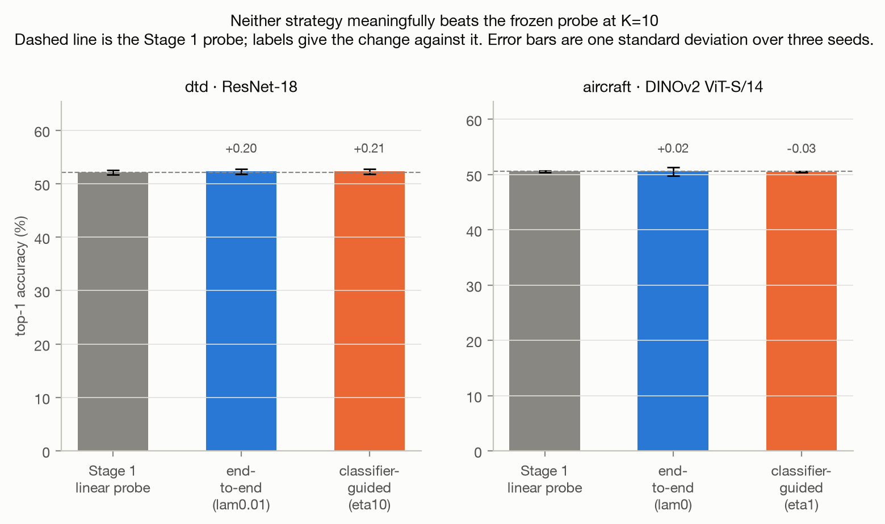
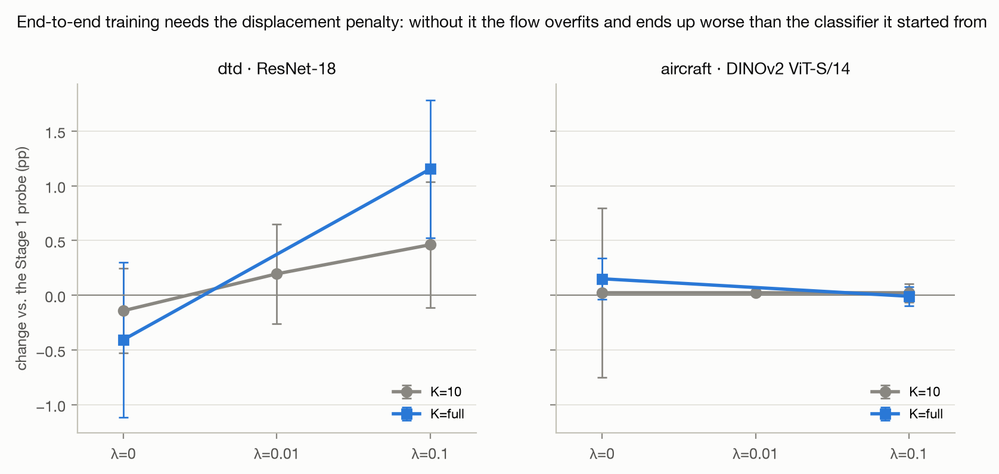
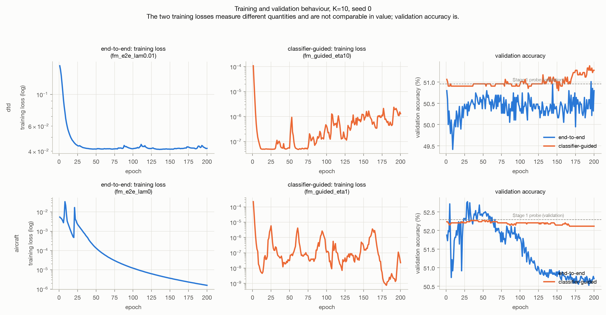
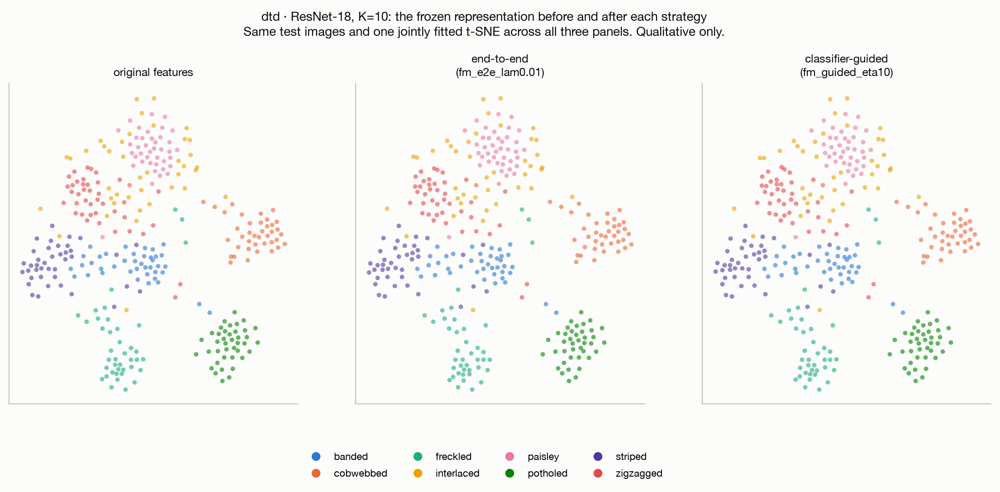

# Stage 3 — Report

**Status:** complete. Both required strategies run on both datasets, plus a diagnostic at
K=full; results, figures and analysis below.

Builds on [REPORT_STAGE1.md](REPORT_STAGE1.md) and [REPORT_STAGE2.md](REPORT_STAGE2.md).

---

## 1. What Stage 3 adds

A flow-matching transform is placed *in front of* a frozen linear classifier:

```
z ──FM (T Euler steps)──► ẑ ──frozen W, b──► logits
```

The classifier is the Stage 1 linear probe, trained exactly as before and then frozen. Only the
velocity network is trained. The question is whether the flow can reshape frozen encoder
features into a representation the *existing* classifier handles better — not a better
classifier, but a better presentation of the data to the one we already have.

**This inverts Stage 2.** There the flow had a fixed geometric destination — the class
prototype — and classification followed from proximity to it. Here there is no destination at
all, only a downstream loss, so the flow must work out for itself what "better" means to a
classifier it cannot change.

Only the velocity network is trained. The encoder was frozen in Stage 1 and stays frozen; the
classifier is now frozen too.

## 2. Protocol

| | |
|---|---|
| Datasets and encoders | DTD · ResNet-18, FGVC-Aircraft · DINOv2 ViT-S/14 |
| Training size | K = 10 (the spec's suggested default), same subsets and seeds as Stage 1 |
| Euler steps | T = 4, fixed throughout |
| Velocity network | The Stage 2 architecture unchanged: MLP, `[z ; t]` in, two hidden layers of 512, SiLU |
| Optimiser | AdamW, lr 1e-3, batch 64, 200 epochs, best-validation checkpointing |
| Runs | 2 datasets × 2 strategies × variants × 3 seeds = 30, plus 12 for the K=full diagnostic |

The spec asks this stage to be narrowed to one encoder per dataset, one training-set size and
one T. DTD has only one encoder; on Aircraft, DINOv2 is the stronger probe (67.7% against
38.1% at K=full) and therefore the harder and more interesting baseline to try to beat. T=4 was
chosen because Stage 2 showed T=4 and T=12 differ by less than seed noise while T=4 is three
times cheaper to backpropagate through.

**Three implementation decisions:**

- **The flow starts at exact identity.** The velocity network's final layer is
  zero-initialised, so `v(z, t) = 0`, every Euler step adds nothing, and `ẑ = z`. Before
  training, the Stage 3 system *is* the Stage 1 probe — not approximately. Only the last layer
  is zeroed: its inputs are still non-zero, so gradients reach it on the first backward pass,
  whereas zeroing an earlier layer would cut the gradient path and the network would never
  train.
- **Features are raw, not L2-normalised.** This is the opposite of Stage 2 and the easiest
  mistake to make by copying that code. The probe was fitted to raw cached features, whose
  norms run from about 9 to 54; handing it unit-norm inputs would present a distribution it has
  never seen, and the identity start would not reproduce Stage 1 at all.
- **Model selection on validation accuracy**, as in Stage 1, and every hyperparameter — λ for
  Strategy 1, η for Strategy 2 — is chosen from validation in code. The test split plays no
  part in any choice.

### The two strategies

**Strategy 1 — end-to-end rolled-out classification.** Roll the feature through all T steps,
classify with the frozen probe, and backpropagate the cross-entropy through the whole rollout.
A displacement penalty `λ‖ẑ − z‖²` is available; λ ∈ {0, 0.01, 0.1} is swept.

**Strategy 2 — classifier-guided targets.** Ask the classifier which way the feature should
move — the gradient of the loss with respect to the feature itself — step that way to build an
improved target `ẑ′`, and train the flow with Stage 2's ordinary flow-matching loss from `z` to
`ẑ′`. Targets are recomputed every epoch. η ∈ {0.1, 1, 10} is swept.

## 3. Results

Top-1 accuracy (%) on the complete official test split, mean ± standard deviation over three
seeds, at K = 10. The variant shown is the one chosen by validation accuracy. Every variant is
in [results/accuracy_table_stage3.md](results/accuracy_table_stage3.md).

| Pipeline | method | variant | top-1 | Δ vs probe |
|---|---|---|---|---:|
| DTD · ResNet-18 | Stage 1 linear probe | — | 52.09 | |
| | end-to-end | λ=0.01 | 52.29 ± 0.45 | +0.20 |
| | classifier-guided | η=10 | 52.30 ± 0.48 | +0.21 |
| Aircraft · DINOv2 | Stage 1 linear probe | — | 50.56 | |
| | end-to-end | λ=0 | 50.58 ± 0.77 | +0.02 |
| | classifier-guided | η=1 | 50.53 ± 0.08 | −0.03 |



*The main comparison at K=10. The dashed line is the Stage 1 probe and the labels give the
change against it. Every bar is the same height, which is the result: neither strategy moves
the classifier meaningfully in either direction.*

## 4. Verification

| Check | Result |
|---|---|
| The identity-initialised system reproduces the Stage 1 probe | pass — **exactly**, difference 0.0e+00 on all six dataset-seed pairs |
| ...and agrees with the recorded Stage 1 result | pass — within 4.9e-06, the ledger's 5-decimal rounding |
| The classifier is frozen | pass — `requires_grad=False` asserted per run |
| The optimiser updates only the flow | pass — constructed over the velocity network's parameters alone |
| Each seed is paired with the probe trained on that seed's subset | pass, by construction in `load_probe` |
| Re-running is idempotent | pass — ledger unchanged |

**The identity check is the load-bearing one.** Because a zero velocity adds exactly zero at
every Euler step, the flow-through accuracy must equal the classifier's own accuracy bit for
bit — and it does, on every pair. That single test simultaneously confirms the near-identity
initialisation, the frozen classifier, correct seed pairing, and that the features were not
normalised. Had they been, the frozen classifier would have received a distribution it was
never fitted to and this check would have failed immediately.

## 5. Findings

### Neither strategy beats the frozen probe

At K=10 the four deltas are +0.20, +0.21, +0.02 and −0.03, against seed spreads of ±0.08 to
±0.77. Every one is inside the noise. This is a null result, and it is reported as one.

### The reason is the same principle Stage 2 established, at the other end of its range

Stage 2 found that the flow's value was proportional to how much headroom its baseline left:
prototypes on Aircraft · DINOv2 sat 33.4 points below the linear probe, and the flow recovered
23.9 of them. Where the baseline was already strong — DTD, a 3.8-point gap — it recovered
almost nothing.

**Stage 3's baseline is the probe itself, which leaves no headroom by construction.** It is the
trained optimum for these exact features and this exact data. Asking a flow to rearrange
features so that an already-optimal fixed classifier does better is close to asking it to redo
the classifier's job — while seeing only the same ten examples per class the classifier
already used.

Read across the three stages, the pattern is consistent: flow matching is worth exactly as much
as the weakness of the rule it sits in front of.

### End-to-end training overfits catastrophically without regularisation

The clearest mechanism in the stage. On DTD at K=10 with λ=0:

| epoch | training loss | validation accuracy |
|---:|---:|---:|
| 1 | 0.1594 | **51.01** |
| 25 | 0.0001 | 45.53 |
| 200 | 0.0000 | 43.46 |

Training loss reaches **zero** — a perfect fit to 470 training features — while validation
accuracy falls 7.6 points. With the classifier frozen and the flow unconstrained, the cheapest
way to cut the loss is to drive features into whatever region the classifier happens to score
confidently, which need not correspond to anything about the image. Best-validation
checkpointing rescues the run, but only by selecting a checkpoint so early that the flow has
barely moved — which is why λ=0 lands back at the baseline rather than below it.

### The displacement penalty is decisive, not cosmetic

The K=full runs isolate it. On DTD, with identical data and an identical objective:

| λ | Δ vs probe |
|---|---:|
| 0 | **−0.41** |
| 0.1 | **+1.15** |

A **1.56-point swing from the penalty alone**. Without it, end-to-end training still overfits
with 1,880 training features and ends up *worse* than the classifier it started from. With it,
this is the best result in Stage 3 — +1.15 points, positive on all three seeds individually
(+0.91, +0.74, +1.81).



*Change against the Stage 1 probe as the displacement penalty increases, at both training-set
sizes. The K=full curve on DTD is the clearest signal in the stage: strongly negative without
the penalty, clearly positive with it.*

### Classifier-guided training is stable, and inert

The anticipated failure mode of Strategy 2 was instability: its target is recomputed as the
flow changes, so it could chase its own tail. It does not. Across all 199 epoch transitions, at
every η, there was **no epoch with a validation swing greater than one percentage point**.

But it is also the more inert of the two. Its flow-matching loss wanders between 10⁻⁹ and 10⁻⁵
for 200 epochs without settling — the moving target never converges, it simply stops mattering,
because the displacements it asks for are too small to change any decision.



*Training loss for each strategy and validation accuracy for both, at K=10, seed 0. The two
training losses measure different quantities — cross-entropy against flow-matching error — so
they share no axis. The Aircraft end-to-end curve is the one to read: validation accuracy
climbs to 52.7% by epoch 30 and then collapses to 50.7%, which is overfitting in plain sight.*

## 6. Diagnostic: is it the data, or is there nothing to gain?

The null result at K=10 has two candidate explanations, and they are distinguishable by running
the same method with eight times the data. Strategy 1 was therefore repeated at K=full.

| Pipeline | Δ at K=10 | Δ at K=full | reading |
|---|---:|---:|---|
| DTD · ResNet-18 | +0.46 | **+1.15** | data was part of the problem |
| Aircraft · DINOv2 | +0.02 | −0.01 | no headroom, full stop |

*(both at the best λ for that setting)*

**The answer differs by pipeline, and that is informative.** On DTD, more data helps: the gain
roughly doubles and becomes consistent across seeds, so part of the K=10 failure was simply too
few examples to fit a 657,000-parameter transform that generalises. On Aircraft · DINOv2 the
per-seed deltas at K=full are −0.09, +0.03, +0.03 — eight times the data changes nothing at all.
There, the limit is genuinely headroom: DINOv2's features are already close to as linearly
separable as they get, and no rearrangement helps a fixed optimal linear rule.

### What the flow actually does to the representation



*The same test images before the flow and after each strategy, in one jointly fitted t-SNE. The
three panels are nearly indistinguishable.*

That near-identity appearance is the finding, not a failure of the figure. Validation-based
selection keeps the flow close to where it started, because moving further reliably makes
validation worse. The class structure of the frozen representation is essentially preserved —
which is consistent with accuracies that differ by two tenths of a point.

The Aircraft equivalent is at `figures/stage3/feature_space_aircraft.png` and shows the same
thing.

## 7. Figures

All regenerate from `results/runs.csv` and the feature caches via `make table figures-stage3`.

| File | Content |
|---|---|
| `results/accuracy_table_stage3.md` | every variant, with deltas against the Stage 1 probe |
| `figures/stage3/accuracy.png` | the main comparison at K=10 |
| `figures/stage3/loss_curves.png` | training loss per strategy and validation accuracy for both |
| `figures/stage3/feature_space_dtd.png`, `..._aircraft.png` | the representation before and after each strategy |
| `figures/stage3/regularisation.png` | the effect of the displacement penalty at both K |

The variant plotted for each strategy is selected by validation accuracy **in code**, so the
figures and this report cannot disagree about which was chosen, and the test split plays no
part in the selection.

## 8. Remaining work

1. Optional: unfreeze the linear classifier and optimise it jointly with the flow, comparing
   against both the frozen-classifier setting and the original Stage 1 probe.
